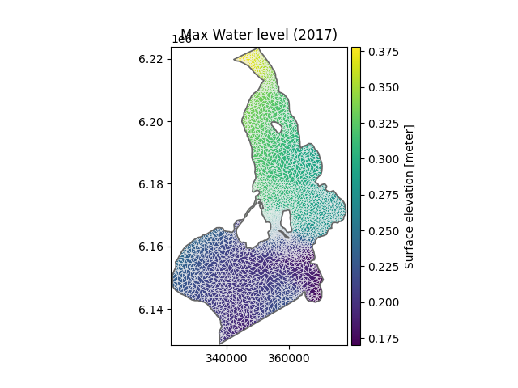

# MIKE IO 1.0

Two years have passed since the first release of MIKE IO and where focus have been on getting things to work smoothly.

Now time has come to revisit the API.

Some design principles:

* Common operations should be possible in very few lines of code
* Readable code, also for project managers :eyes:
* Trivial to save processed data as a new dfs file

A lot of inspiration have come from the [xarray](https://docs.xarray.dev/en/stable/) library, which is great for multidimensional gridded data, but less so for flexible mesh data.

## I want to try it!
1. Install the [preview version](https://github.com/DHI/datatalks/raw/main/talk_2_mikeio/mikeio-1.0.dev20220223-py3-none-any.whl) available here in this folder
```
$ pip install mikeio-1.0.dev20220223-py3-none-any.whl
```

2. Try it in a Google Colab [notebook](https://colab.research.google.com/drive/1Nevw-nhZKwHR4FYZmGSWoZuLfyaDQYn4#scrollTo=MWrpgIGUY70Q) (requires a Google account)

## Examples

```python
>>> import mikeio
>>> ds = mikeio.read("oresundHD_run1.dfsu")
>>> ds
<mikeio.Dataset>
Geometry: Dfsu2D
Dimensions: (time:5, element:3612)
Time: 2018-03-07 00:00:00 - 2018-03-11 00:00:00 (5 records)
Items:
  0:  Surface elevation <Surface Elevation> (meter)
  1:  Total water depth <Water Depth> (meter)
  2:  U velocity <u velocity component> (meter per sec)
  3:  V velocity <v velocity component> (meter per sec)

>>> ds.Surface_elevation
<mikeio.DataArray>
Name: Surface elevation
Geometry: Dfsu2D
Dimensions: (time:5, element:3612)
Time: 2018-03-07 00:00:00 - 2018-03-11 00:00:00 (5 records)

>>> ds.Surface_elevation.max(axis="time")
<mikeio.DataArray>
Name: Surface elevation
Geometry: Dfsu2D
Dimensions: (element:3612)
Time: 2018-03-07 00:00:00 (time-invariant)

>>> ds.Surface_elevation.max(axis="time").to_dfs("max_wl.dfsu")

>>> ds.Surface_elevation.max(axis="time").plot(title="Max Water level (2017)")
```


## Links

You can follow the work in this [Pull Request](https://github.com/DHI/mikeio/pull/272) and in this [Discussion](https://github.com/DHI/mikeio/discussions/279)